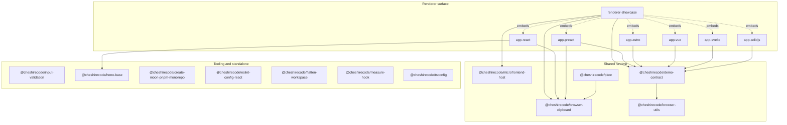

# moon-pnpm-monorepo-boilerplate

A framework-neutral JavaScript monorepo starter with package development, verification, and publishing wired together.

## Stack and requirements

- **pnpm workspaces** for installation and local package linking.
- **moonrepo** for task-graph execution, affected runs, and local caching.
- **Changesets** for package versioning, changelogs, and npm publishing.
- **oxlint** for fast JavaScript and TypeScript linting.

Requires Node.js `>=24.11.0` and pnpm `11.10.0`. GitHub Actions and the Docker verifier use Node 24.

## Quick start

```sh
corepack enable
corepack prepare pnpm@11.10.0 --activate
pnpm install
pnpm run ci
```

## Workspace map

### Renderer surface

Six private framework apps are embedded by one private showcase host.

<table>
  <thead>
    <tr><th>Technology</th><th>Package</th><th>Role</th></tr>
  </thead>
  <tbody>
    <tr><td> React</td><td><a href="packages/app-react/"><code>app-react</code></a><br><sub>TSX</sub></td><td>React renderer demo and mount adapter.</td></tr>
    <tr><td> Preact</td><td><a href="packages/app-preact/"><code>app-preact</code></a><br><sub>TSX</sub></td><td>Preact renderer demo and mount adapter.</td></tr>
    <tr><td> Astro</td><td><a href="packages/app-astro/"><code>app-astro</code></a><br><sub>Astro → TS</sub></td><td>Astro static renderer demo.</td></tr>
    <tr><td> Vue.js</td><td><a href="packages/app-vue/"><code>app-vue</code></a><br><sub>Vue → TS</sub></td><td>Vue renderer demo and mount adapter.</td></tr>
    <tr><td> Svelte</td><td><a href="packages/app-svelte/"><code>app-svelte</code></a><br><sub>Svelte → TS</sub></td><td>Svelte renderer demo and mount adapter.</td></tr>
    <tr><td> Solid</td><td><a href="packages/app-solidjs/"><code>app-solidjs</code></a><br><sub>TSX</sub></td><td>Solid renderer demo and mount adapter.</td></tr>
    <tr><td> TypeScript</td><td><a href="packages/renderer-showcase/"><code>renderer-showcase</code></a><br><sub>TS</sub></td><td>Vite host for all six renderer demos.</td></tr>
  </tbody>
</table>

### Shared runtime graph

Publishable packages connected by internal runtime dependencies.

<table>
  <thead>
    <tr><th>Technology</th><th>Package</th><th>Role</th></tr>
  </thead>
  <tbody>
    <tr><td> TypeScript</td><td><a href="packages/microfrontend-host/"><code>@cheshirecode/microfrontend-host</code></a><br><sub>TS</sub></td><td>Framework-neutral microfrontend host shell.</td></tr>
    <tr><td> TypeScript</td><td><a href="packages/demo-contract/"><code>@cheshirecode/demo-contract</code></a><br><sub>TS</sub></td><td>Shared renderer demo contract and helpers.</td></tr>
    <tr><td> TypeScript</td><td><a href="packages/browser-clipboard/"><code>@cheshirecode/browser-clipboard</code></a><br><sub>TS</sub></td><td>Browser-safe clipboard access.</td></tr>
    <tr><td> TypeScript</td><td><a href="packages/browser-utils/"><code>@cheshirecode/browser-utils</code></a><br><sub>TS</sub></td><td>Shared string, form, filtering, and URL helpers.</td></tr>
    <tr><td> TypeScript</td><td><a href="packages/pkce/"><code>@cheshirecode/pkce</code></a><br><sub>TS</sub></td><td>PKCE library with a browser demo.</td></tr>
  </tbody>
</table>

### Tooling and standalone

CLIs, shared configuration, and packages without an internal runtime edge.

<table>
  <thead>
    <tr><th>Technology</th><th>Package</th><th>Role</th></tr>
  </thead>
  <tbody>
    <tr><td> TypeScript</td><td><a href="packages/create-moon-pnpm-monorepo/"><code>@cheshirecode/create-moon-pnpm-monorepo</code></a><br><sub>TS</sub></td><td>CLI that generates a clean starter workspace.</td></tr>
    <tr><td> TypeScript</td><td><a href="packages/flatten-workspace/"><code>@cheshirecode/flatten-workspace</code></a><br><sub>TS</sub></td><td>CLI for flattening workspace package manifests.</td></tr>
    <tr><td> TypeScript</td><td><a href="packages/input-validation/"><code>@cheshirecode/input-validation</code></a><br><sub>TS</sub></td><td>Sanitizer-backed input validation helpers.</td></tr>
    <tr><td> TypeScript</td><td><a href="packages/hono-base/"><code>@cheshirecode/hono-base</code></a><br><sub>TS</sub></td><td>Runtime-neutral Hono app factory.</td></tr>
    <tr><td> JavaScript</td><td><a href="packages/measure-hook/"><code>@cheshirecode/measure-hook</code></a><br><sub>JS</sub></td><td>Small synchronous and asynchronous timing helper.</td></tr>
    <tr><td> React</td><td><a href="packages/eslint-config-react/"><code>@cheshirecode/eslint-config-react</code></a><br><sub>JS</sub></td><td>Shared ESLint flat configuration for React.</td></tr>
    <tr><td> TypeScript</td><td><a href="packages/tsconfig/"><code>@cheshirecode/tsconfig</code></a><br><sub>JSON config</sub></td><td>Shared TypeScript compiler configurations.</td></tr>
  </tbody>
</table>



The graph intentionally omits external framework dependencies and repetitive development-only edges to the shared TypeScript and ESLint configurations.

## Development

Keep framework-specific setup inside its package. Use a narrow Moon target while iterating, then run the routine repository checks:

```sh
pnpm moon run pkce:test
scripts/check.sh ci
```

Broaden verification only for the surface changed: `package-drift` for topology or metadata, `renderer-showcase` for renderer or host-shell work, `dogfood packages` for package-facing changes, and `docker` for toolchain or workflow changes. The full agent verification contract lives in [AGENTS.md](AGENTS.md).

## Publishing

1. Run `pnpm changeset` for a user-facing package change.
2. Verify publishable tarballs with `scripts/check.sh pack` and external consumption with `scripts/check.sh dogfood packages`.
3. Merge the Changesets release PR; the `publish` workflow publishes from `main` after its dry-run checks pass.

The six renderer apps and `renderer-showcase` are private and excluded from Changesets.

## Renderer showcase

`packages/renderer-showcase` is a plain HTML/Vite host for all six renderer demos. Client-rendered apps expose package-local `mount(container): () => void` adapters; Astro provides a static tile through the shared demo contract. Reusable host logic stays in `@cheshirecode/microfrontend-host`.

```sh
scripts/check.sh renderer-showcase
```

## Agents

Read [AGENTS.md](AGENTS.md) before making changes. It defines the repository's editing invariants and verification matrix.
